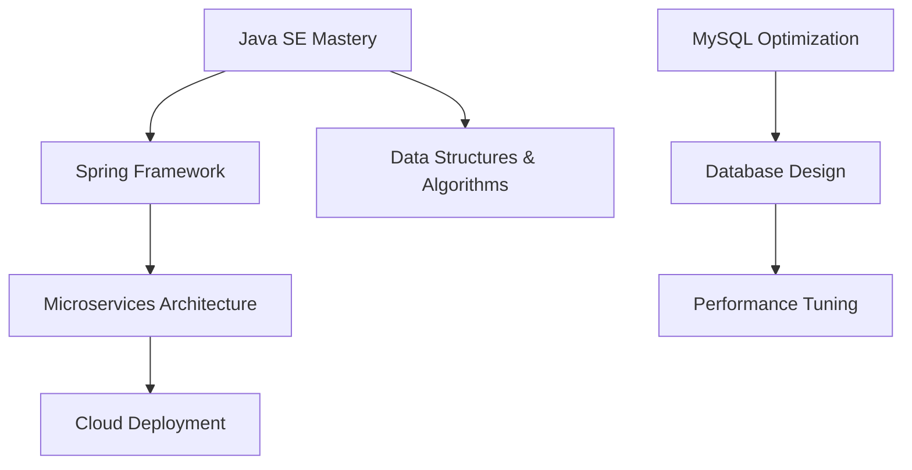
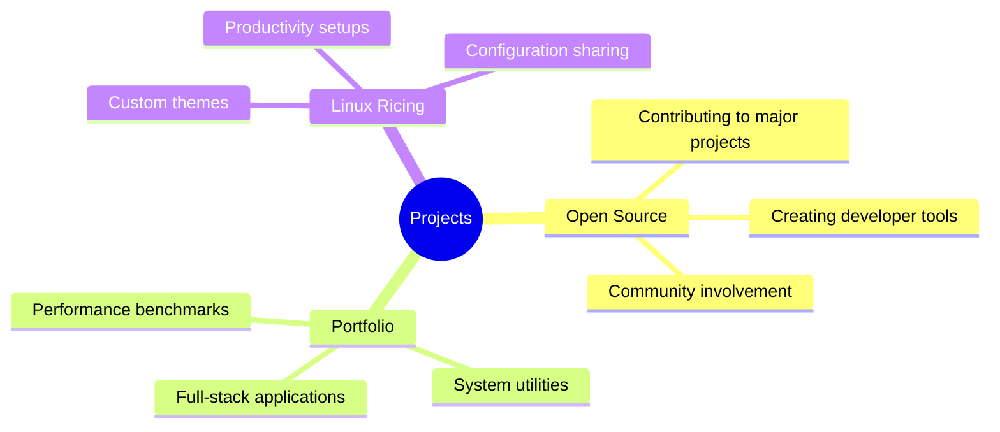

# 

  

  
  

  

    
    
    
  

---

  <h2>🌟 About Me</h2>

- 🔭 **Currently Learning:** Advanced Java SE concepts and MySQL optimization
- 🎯 **Focus Areas:** Clean code architecture and system performance
- ⚡ **Specialties:** Zsh customization, Hyprland configurations, Linux ricing
- 🎨 **Creative Side:** Designing aesthetic and functional desktop environments
- 🌱 **Growth Mindset:** Always exploring new technologies and methodologies

---

  <h2>🛠️ Technology Arsenal</h2>

### 💻 Programming Languages

  

### 🎨 Frontend & Styling

  

### 🔧 Tools & Platforms

  

### 🐧 Operating Systems & Environment

  
  
  

### 📊 Databases

  

---

  <h2>🏆 Professional Certifications</h2>

<table>
<thead>
<tr>
<th align="left">🎓 Certification</th>
<th align="center">🏢 Issuer</th>
<th align="center">📅 Date</th>
<th align="center">🔗 Credential</th>
<th align="center">✅ Status</th>
</tr>
</thead>
<tbody>
<tr>
<td><strong>Google Crash Course on Python</strong></td>
<td align="center">Google/Coursera</td>
<td align="center">Apr 2024</td>
<td align="center"><code>CTHXMTAKAFKT</code></td>
<td align="center"></td>
</tr>
<tr>
<td><strong>HackerRank SQL (Basic)</strong></td>
<td align="center">HackerRank</td>
<td align="center">Jun 2024</td>
<td align="center"><code>36b2cd5d4dfc</code></td>
<td align="center"></td>
</tr>
<tr>
<td><strong>HackerRank CSS (Basic)</strong></td>
<td align="center">HackerRank</td>
<td align="center">Dec 2024</td>
<td align="center"><code>fb11cbbd3c44</code></td>
<td align="center"></td>
</tr>
</tbody>
</table>

---

  <h2>📊 GitHub Analytics</h2>

### 📈 Performance Metrics

  
  
  
  

### 🎯 Language Proficiency

### 📈 Contribution Activity

---

  <h2>🎯 Current Roadmap</h2>

<table>
<tr>
<td width="50%" valign="top">

### 🎓 Learning Journey

**Current Focus:**
- 📚 Advanced Java concepts and design patterns
- 🗄️ MySQL query optimization and indexing
- 🏗️ System design and scalable architectures
- 🔧 DevOps practices and automation tools

</td>
<td width="50%" valign="top">

### 🚀 Project Ambitions

**Upcoming Goals:**
- 🌟 Launch 3 major open-source projects
- 💼 Build production-ready portfolio applications
- 🎨 Create comprehensive Linux rice documentation
- 🤝 Mentor newcomers in the community

</td>
</tr>
</table>

---

  <h2>💼 Areas of Excellence</h2>

<table>
<tr>
<td align="center" width="33%">

### 🖥️ **Linux Mastery**

🎨 **Aesthetic Design**
- Custom XFCE & Hyprland setups
- Color scheme development
- Icon and theme creation

⚡ **Performance Optimization**
- System resource management
- Boot time optimization
- Memory usage tuning

</td>
<td align="center" width="33%">

### 🔧 **Terminal Wizardry**

🚀 **Productivity Tools**
- Custom shell configurations
- Automation script development
- Workflow optimization

💡 **Innovation**
- Terminal-based applications
- Command-line utilities
- Developer productivity enhancement

</td>
<td align="center" width="33%">

### 💻 **Software Engineering**

🏗️ **Architecture Design**
- Clean code principles
- Design pattern implementation
- Scalable system design

🔍 **Quality Assurance**
- Code review practices
- Performance optimization
- Testing methodologies

</td>
</tr>
</table>

---

  <h2>🌐 Let's Connect</h2>

<table>
<tr>
<td align="center" width="50%">

### 📧 **Professional Contact**

*Available for professional opportunities and collaborations*

</td>
<td align="center" width="50%">

### 🐙 **GitHub Profile**

*Explore my repositories and contributions*

</td>
</tr>
</table>

### 🤝 **Collaboration Opportunities**

  
  
  
  

**I'm passionate about:**
- 🌟 Contributing to impactful open-source projects
- 💡 Collaborating on innovative technological solutions
- 📚 Sharing knowledge and learning from the community
- 🚀 Exploring new opportunities for professional growth

---

  <h2>💭 Philosophy</h2>

### ✨ *"Code is like humor. When you have to explain it, it's bad."*
**– Cory House**

---

### 🎯 **My Development Principles**

  

    <h4>🎨 Beauty</h4>
    
<em>Elegant, readable code</em>

  

  

    <h4>⚡ Performance</h4>
    
<em>Efficient, optimized solutions</em>

  

  

    <h4>🔍 Simplicity</h4>
    
<em>Clear, maintainable design</em>

  

  

    <h4>🤝 Collaboration</h4>
    
<em>Community-driven development</em>

  

---

### 🌟 **Thank You for Visiting!**

  

**"The future belongs to those who believe in the beauty of their dreams."**

